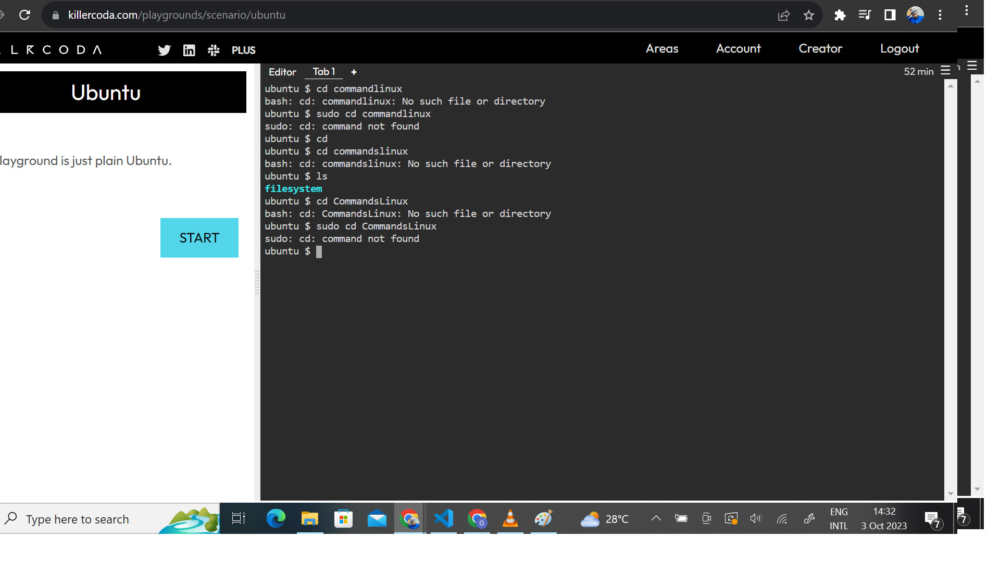
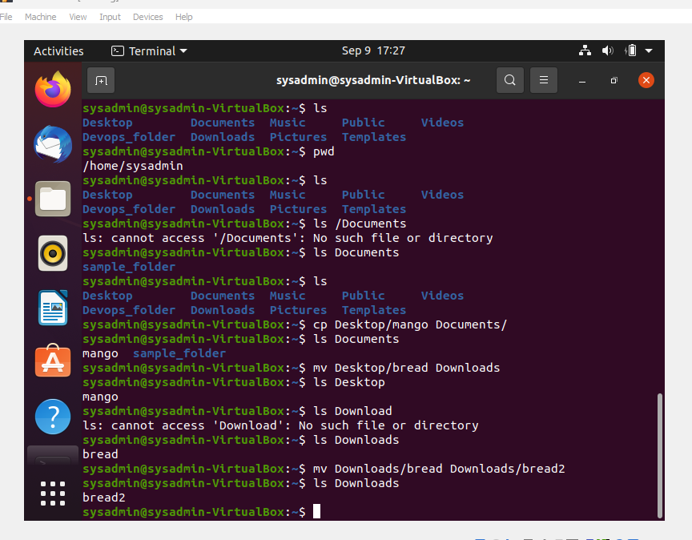

# Linux Practice Projects

### File Manipulation

<!-- UL -->
* SUDO COMMAND

`sudo apt upgrade`

<!-- UL -->
* PASSWORD COMMAD

`pwd`

This command is used to print the current working directory

<!-- UL -->
* CD COMMAND

`cd`

<!-- UL -->
* IS COMMAND

`Is`

this command format the way the listed contents are displayed

<!-- UL -->
* CAT COMMAND

`cat`

<!-- UL -->
* CP COMMAND

`cp`

<!-- UL -->
* MV COMMAND

`mv`

<!-- UL -->
* MKDIR COMMAND

`mkdir`

To remove directories

<!-- UL -->
* RM COMMAND

`rm`

<!-- UL -->
* TOUCH COMMAND

<!-- UL -->
* LOCATE COMMAND

<!-- UL -->
* FIND COMMAND

<!-- UL -->
* GREP COMMAND

<!-- UL -->
* DF COMMAND

<!-- UL -->
* DU COMMAND

<!-- UL -->
* HEAD COMMAND

<!-- UL -->
* TAIL COMMAND

<!-- UL -->
* DIFF COMMAND

<!-- UL -->
* TAR COMMAND

[FILE PERMISSION AND OWNERSHIP]

<!-- UL -->
* CHMOD COMMAND

<!-- UL -->
* CHOWN COMMAND

<!-- UL -->
*JOBS COMMAND

<!-- UL -->
* KILL COMMAND

<!-- UL -->
* PING COMMAND

<!-- UL -->
* WGET COMMAND

<!-- UL -->
* UNAME COMMAND

<!-- UL -->
* TOP COMMAND

<!-- UL -->
* HISTORY COMMAND

<!-- UL -->
* MAN COMMAND

<!-- UL -->
* ECHO COMMAND

<!-- UL -->
* ZIP, UNZIP COMMAND

`ZIP`

`UNZIP`

<!-- UL -->
* HOSTNAME COMMAND

<!-- UL -->
* USERADD, USERDEL COMMANDS

<!-- UL -->
* APT-GET COMMAND

<!-- UL -->
* NANO, VI, JED COMMANDS

<!-- UL -->
* ALIAS, UNALIAS COMMANDS

<!-- UL -->
* SU COMMANDS

<!-- UL -->
* HTOP COMMANDS

<!-- UL -->
* PS COMMANDS

 END